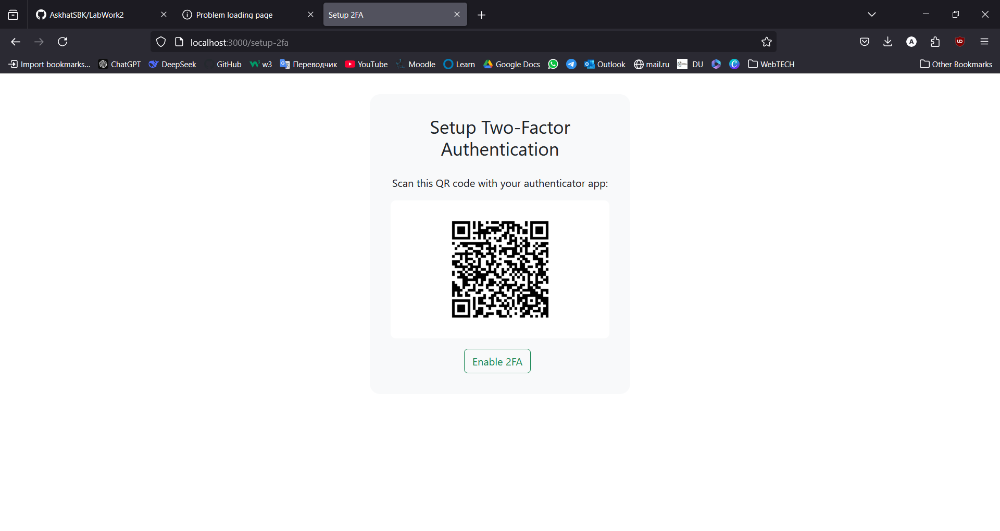

# LabWork2

# Assignment 3 - Authentication with 2FA

This project is a simple web application that demonstrates user authentication with Two-Factor Authentication (2FA) using Node.js, Express, MongoDB, and various other libraries.

## Features

- User registration and login
- Password hashing using bcrypt
- Two-Factor Authentication (2FA) using Time-based One-Time Password (TOTP)
- QR code generation for 2FA setup
- Session management using express-session
- Dashboard for authenticated users

## Prerequisites

Before you begin, ensure you have met the following requirements:

- Node.js and npm installed on your machine
- MongoDB installed and running locally or a MongoDB Atlas account
- Basic understanding of JavaScript, Node.js, and Express

## Installation

1. Install the required dependencies:

    ```bash
    npm init -y
    npm install dotenv express mongoose express-session bcrypt speakeasy qrcode ejs
    ```

2. Start the server:

    ```bash
    node server.js
    ```

3. Open your browser and navigate to `http://localhost:3000`.

## Usage

### Register a New User

1. Navigate to the registration page (`/register`).
2. Fill in the form with your desired username, email, and password.
3. Submit the form to create a new user.

### Login

1. Navigate to the login page (`/login`).
2. Enter your username and password.
3. If 2FA is enabled, you will be redirected to the OTP page to enter the code from your authenticator app.

### Setup 2FA

1. Log in to your account.
2. Navigate to the 2FA setup page (`/setup-2fa`).
3. Scan the QR code with your authenticator app (e.g., Google Authenticator).
4. Enter the OTP from your app to enable 2FA.

### Dashboard

1. After successful login, you will be redirected to the dashboard (`/dashboard`).
2. The dashboard displays your user information.

### Logout

1. Click the logout button or navigate to `/logout` to end your session.

## Dependencies

- [express](https://expressjs.com/) - Web framework for Node.js
- [mongoose](https://mongoosejs.com/) - MongoDB object modeling tool
- [bcrypt](https://www.npmjs.com/package/bcrypt) - Password hashing
- [speakeasy](https://www.npmjs.com/package/speakeasy) - Two-factor authentication
- [qrcode](https://www.npmjs.com/package/qrcode) - QR code generation
- [dotenv](https://www.npmjs.com/package/dotenv) - Environment variable management
- [express-session](https://www.npmjs.com/package/express-session) - Session management
- [ejs](https://ejs.co/) - Templating engine

## Contributing

Contributions are welcome! Please follow these steps:

1. Fork the project.
2. Create your feature branch (`git checkout -b feature/AmazingFeature`).
3. Commit your changes (`git commit -m 'Add some AmazingFeature'`).
4. Push to the branch (`git push origin feature/AmazingFeature`).
5. Open a Pull Request.

## License

This project is licensed under the MIT License - see the [LICENSE](LICENSE) file for details.

## Acknowledgments

- [Speakeasy](https://github.com/speakeasyjs/speakeasy) for the 2FA implementation
- [QRCode](https://github.com/soldair/node-qrcode) for QR code generation
- [Express](https://expressjs.com/) for the web framework
- [Mongoose](https://mongoosejs.com/) for MongoDB object modeling

## Appendices

1. 


2.


3.


4.


5.


6.
